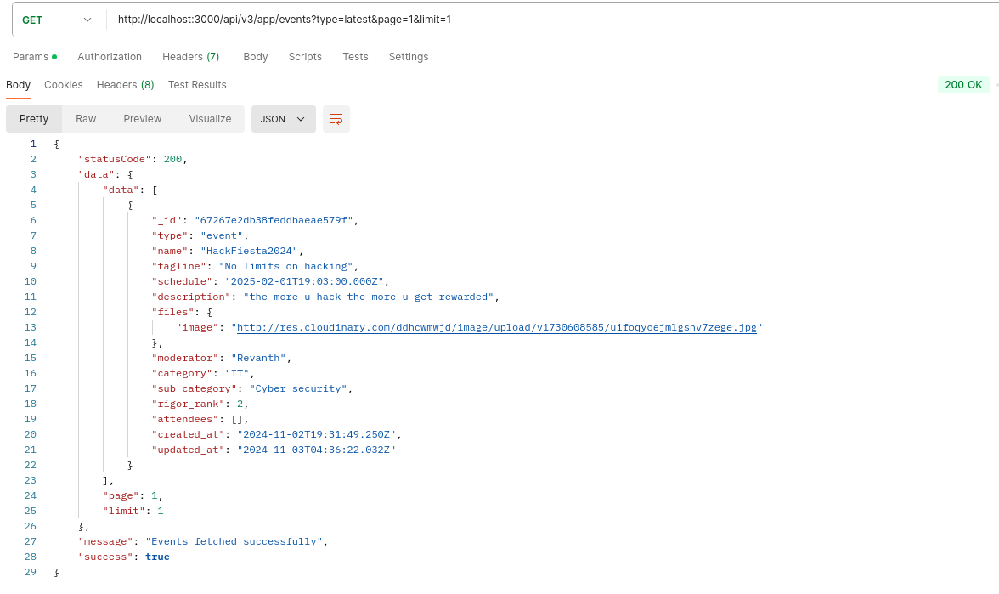
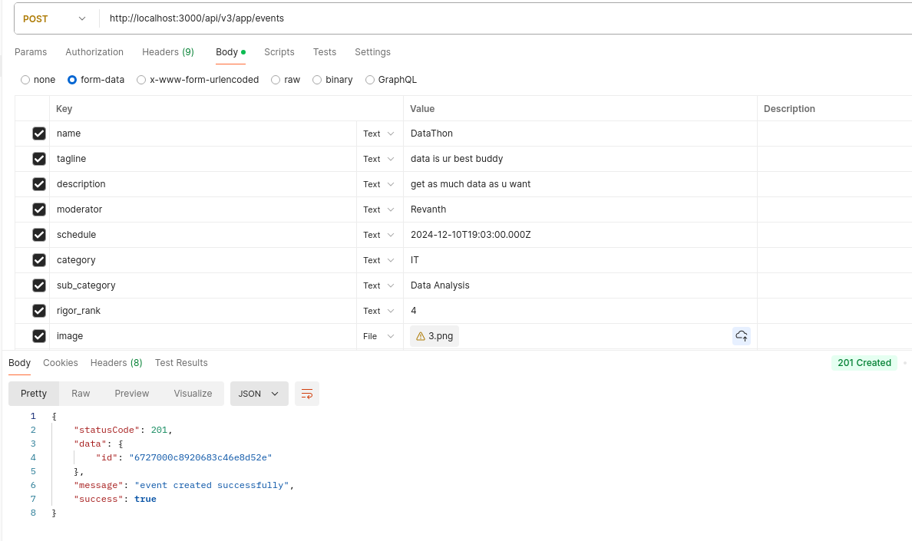
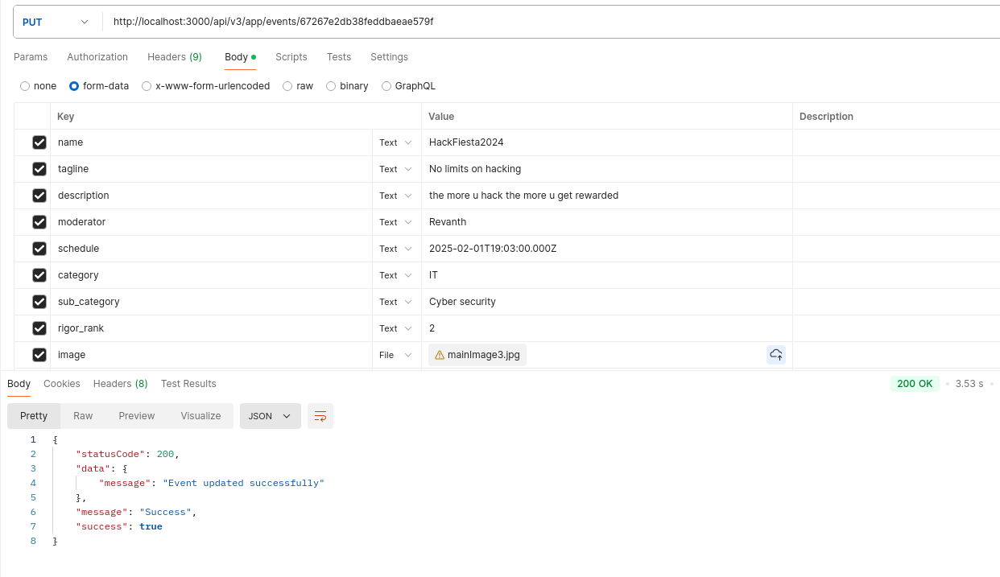
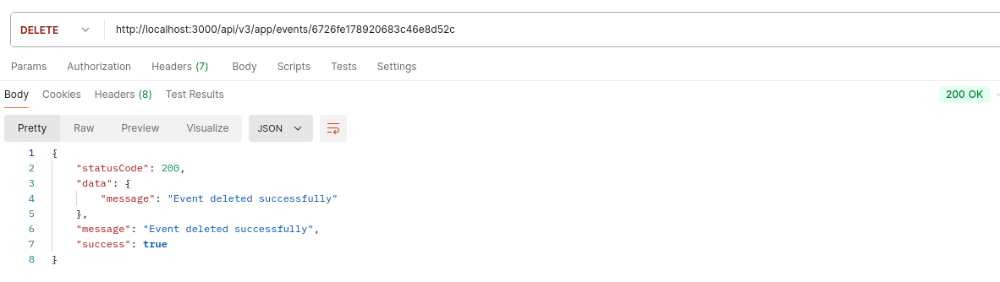

# Task1 Project Documentation

## Overview

Task1 is a backend application built with Node.js. It is designed to manage event-related operations such as creating, updating, deleting, and fetching events. The project includes database connectivity, routing, middleware, and controller logic.

## Folder Structure

```
src/
|-- app.js
|-- config/
|   |-- db.js
|-- controllers/
|   |-- event.controller.js
|-- middlewares/
|   |-- errorHandler.middleware.js
|   |-- multer.middleware.js
|-- routes/
|   |-- event.route.js
|-- services/
|   |-- event.service.js
|-- utils/
|   |-- ApiError.js
|   |-- ApiResponse.js
|   |-- asyncHandler.js
|   |-- cloudinary.js
```

## Setup

### Prerequisites

- Node.js
- npm (Node Package Manager)
- MongoDB
- Cloudinary

### Installation

1. Clone the repository:

   ```sh
   git clone https://github.com/Revanth221/dt_backend.git
   cd dt_backend/task1
   ```

2. Install the dependencies:

   ```sh
   npm install
   ```

3. Create a `.env` file in the root directory and add the following environment variables:
   ```sh
   PORT=3000
   MONGODB_URI=your_mongodb_uri
   CLOUDINARY_CLOUDNAME=your_cloudinary_cloudname
   CLOUDINARY_API_KEY=your_cloudinary_apikey
   CLOUDINARY_API_SECRET=your_cloudinary_apisecret
   ```

### Running the Application

Start the server:

```sh
npm start
```

The server will run on `http://localhost:3000`.

## API Testing with Postman

GET
POST
PUT
DELETE

## API Endpoints

### Event Routes

- **GET /api/v3/app/events**: Fetch all events or a specific event by ID.
- **POST /api/v3/app/events**: Create a new event (with image upload).
- **PUT /api/v3/app/events/:id**: Update an existing event by ID (with image upload).
- **DELETE /api/v3/app/events/:id**: Delete an event by ID.

### Image Handling in POST Request

When a user submits an image in a POST request to the `/api/v3/app/events` endpoint:

1. The image is first stored locally.
2. Then stored image is uploaded to Cloudinary.
3. Then URL of the uploaded image is obtained from Cloudinary.
4. Then `image` field is set to obtained URL not the path of image.
5. And then event is stored in database.
6. This ensures that the uploaded image is accessible from anywhere when requested.

## Key Files

### app.js

The main entry point of the application. It sets up the Express server, connects to the database, initializes services, and defines routes and middleware.

### event.route.js

Defines the routes related to event operations and uses the respective controller functions to handle requests.

### event.controller.js

Contains the logic for handling event-related operations such as fetching, creating, updating, and deleting events. It utilizes services and middleware for database interactions and error handling.

## Middleware

- **errorHandler.middleware.js**: Handles errors and sends appropriate responses.
- **multer.middleware.js**: Handles file uploads using Multer.

## Services

- **event.service.js**: Contains business logic for event operations and interacts with the database.

## Utilities

- **ApiError.js**: Defines custom API error responses.
- **ApiResponse.js**: Defines custom API success responses.
- **asyncHandler.js**: Handles asynchronous operations and errors.
- **cloudinary.js**: Handles image uploads to Cloudinary.

---
